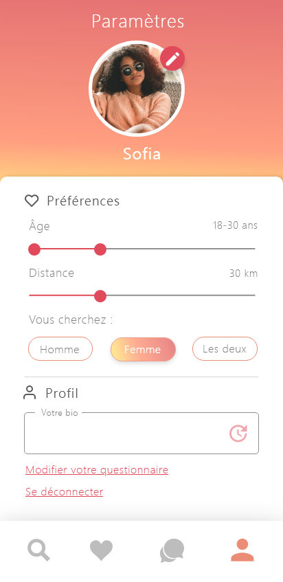

_Kyle ESPARON & Juline GABROVEC_

# Certain

Une application mobile Android / iOS permettant de matcher et discuter avec des gens autour de toi !

### Contexte 

L’idée de développer une application de rencontre est survenu après réflexion sur la question “Quel est le type d’application le plus tendance et surtout le plus passe-partout aujourd’hui ?”. En fait, malgré le peu de ressource, la taille de notre équipe et les contraintes de délai, nous avons voulu développer une application peu complexe à conceptualiser mais qui tend à intéresser le plus de personne.
Bien sûr, les concurrents sont bien présents (Tinder, Fruitz, Lovoo…) et des nouveaux émergent. Nous avons donc cherché à rendre l’application originale pour se distinguer en y ajoutant le concept de questionnaire.
Le questionnaire aura pour but de filtrer les personnes selon leur personnalité, pour assurer une correspondance maximum. Ce concept est à l’origine du nom de l’application “Certain”, faisant référence au fait qu’on soit quasiment certain que la personne nous corresponde. Lorsque deux personnes ont matché et ont tous deux réussi le questionnaire de l’autre, elles auront la possibilité de chatter directement sur l’application, pour faire plus ample connaissance.

### Périmètre

Cette application a l’avantage de toucher un large public. En effet, déjà en 2016, plus d’un jeune âgé de 18 à 25 ans sur quatre fréquentait au moins un site de rencontre, 19% chez les 26-30 ans et 13% chez les 31-35 ans. Au-delà de 36 ans, les pourcentages chutent en dessous des 10% mais le taux est quand même correct. Ces chiffres ont encore augmenté en 2020.

### Ressources

_Flutter_

La technologie principale choisie pour réaliser notre application est le framework Flutter, conçu par Google.
Ce choix a premièrement été réalisé car la plupart des technologies multi-plateformes sont composées de parties spécifiques à Android et iOS, ce qui rend le développement plus long et plus complexe alors qu’ici seul un code commun est nécessaire et s’adapte parfaitement aux deux systèmes d’exploitation.
De plus, Flutter est un outil de plus en plus populaire et possède donc une liste intéressante de packages (disponible sur https://pub.dev/). Cela nous permet donc un développement largement plus rapide en évitant de nous attarder sur des fonctionnalités moins importantes.
Nous avons combiné Flutter avec le BLoC pattern. Il permet de séparer la présentation de la logique métier. Suivre le modèle BLoC facilite la testabilité et la réutilisabilité. Il permet aux développeurs de se concentrer sur l'écriture de la logique métier car elle peut :
- être déplacée vers un ou plusieurs BLoC.
- être supprimée autant que possible de la couche présentation. En d’autres termes, les composants de l’interface utilisateur ne doivent se soucier que des problèmes liés à l’interface utilisateur et non de la logique applicative/métier.
- s’appuyer sur l’utilisation exclusive de Streams pour les entrées (Sink) et les sorties (Stream).

_Dart_

Dart est le langage créé par Google et utilisé par Flutter. Il est orienté objet et est très facile à prendre en main quand on maîtrise déjà C, Java ou JavaScript. Il s’agit en fait d’une alternative à JavaScript dans laquelle on a limité les défauts.

_GitHub_

Le gestionnaire de version utilisé est GitHub tout simplement car c’est le plus populaire et que son système de gestion de tickets est simple d’utilisation et efficace.

_Firebase_

Côté back-end, nous utilisons Firebase, facilement combinable avec Flutter. Il nous permet d'héberger notre base de données avec une offre gratuite et d’y effectuer des requêtes NoSQL en temps réel.

_Android Studio_

Nous utilisons l’IDE Android Studio sur lequel Flutter est très bien adapté. L’avantage est qu’il est très utile pour tester les interfaces graphiques. On peut facilement changer le type d'écran de l’émulateur intégré et cela permet de vérifier que nos interfaces sont bien compatibles avec les différents appareils Android.
De plus, sur cet IDE, nul besoin d’installer des multitudes de plugins pour profiter de fonctionnalités intéressantes comme le système de Hot Reload et de développement sur son téléphone personnel.

### Fonctionnalités

_Profil_

Pour accéder à l’application il est nécessaire de créer un compte et un profil utilisateur, contenant les informations suivantes : 
- prénom *
- sexe *
- adresse email *
- date de naissance *
- sexe de la personne recherchée * (homme / femme / les deux)
- bio
- questionnaire *
- photo de profil *

(*) Informations obligatoires

       

Il est possible pour l'utilisateur de modifier les informations de son profil à tout moment dans la page paramètres. Il est également possible de paramétrer le périmètre de recherche et la tranche d’âge des personnes recherchées.

_Profils proposés_

Les profils proposés à chaque utilisateur sont sélectionnés en fonction de leur localisation et des critères définis dans le profil . 
Pour chaque profil proposé, il y a possibilité de lire le nom, l’âge, le sexe, la description, regarder la photo et de liker ou disliker le profil (en balayant l'écran à droite ou à gauche ou via les deux boutons dédiés).

Lorsque deux utilisateurs se sont likés mutuellement on dit qu'il y a un match, un pop-up apparaît alors sur l'écran indiquant cet évènement.

Tous les matchs en attente sont ensuite consultables dans la page "Vos matchs". Les matchs en attente sont les matchs pour lesquels l'utilisateur n'a pas encore répondu au questionnaire. Pour chaque match il est donc possible soit de répondre au questionnaire soit de supprimer le match.

      

_Questionnaire_

Le QCM est composé de 6 questions avec une seule réponse possible, créé par chaque utilisateur à la création de son profil. Il est possible d’éditer son questionnaire à tout moment dans les paramètres. Le choix des questions par l’utilisateur est fait parmi une banque de questions proposées. 
Quand un utilisateur match avec une autre personne, il doit répondre au QCM créé par ce dernier. Si son taux de réponses justes est supérieur ou égal à 50% (c’est-à-dire au moins 3 réponses correctes) et vice-versa, alors un chat est ouvert et les deux personnes peuvent entrer en discussion.

_Chat_

C’est un système de messagerie instantanée. Il ne permet pas d’envoyer de photo pour éviter que les personnes envoie des images à caractère sexuel, ce qui pourrait facilement survenir sur ce type d’application. Il est possible de supprimer une discussion en restant appuyer quelques secondes sur celle-ci.

       

_Les paramètres_

C’est la page permettant de paramétrer les données de l’utilisateur suivantes :
- rayon de recherche de personne
- tranche d’âge des personnes recherchées
- sexe de la personne recherchée
- bio
- questionnaire
- photo de profil
L'utilisateur a également la possibilité via cette page de se déconnecter.

### Cas d'utilisation

Lors de la première utilisation, l’utilisateur doit se créer un compte pour pouvoir accéder à l’application. Ce compte est lié uniquement à l’application, il est créé avec une adresse email et un mot de passe.  
L’utilisateur doit ensuite créer son profil en indiquant son prénom, sa date de naissance, son sexe, le sexe de la personne qu’il recherche, et en chargeant une photo de profil.
Ensuite, l’utilisateur doit créer le questionnaire qui sera soumis à ses futurs matchs. En choisissant chacune des questions et en indiquant la réponse qui lui semble correcte.  L’utilisateur a maintenant accès à l’ensemble des fonctionnalités de l’application.  
Il va pouvoir dans ses paramètres modifier son profil ainsi que son questionnaire. Mais également renseigner ses critères de recherche (âge et distance), et écrire une petite biographie pour que les autres utilisateurs puissent mieux le connaître.  
L’utilisateur peut découvrir les profils qui lui sont proposés en fonctions des critères qu’il a définis. Il peut liker ou disliker un profil soit avec les boutons prévus à cet effet soit en balayant l’écran à droite (pour liker) ou à gauche (pour disliker). Cette décision est définitive une fois qu’un profil est liké ou disliké il n’apparaitra plus dans le flux des profils à découvrir.   
Si l’utilisateur like le profil d’un utilisateur qui avait déjà liké son profil alors il va voir apparaitre un message lui indiquant qu’il a matché avec cet utilisateur.  
Il pourra ensuite retrouver ce match sur la page qui répertorie tous ses matchs en attente. Il a maintenant la possibilité de répondre au questionnaire de l’utilisateur avec qui il a matché ou bien de supprimer le match. S’il décide de répondre au questionnaire et qu’il a plus de 50 % de réponses correctes et que l’autre utilisateur aussi, alors un message s’affiche indiquant qu’il a réussi et que les utilisateurs vont pouvoir discuter.  
En effet, l’utilisateur va voir apparaitre dans la messagerie instantanée de l’application une nouvelle discussion avec l’autre utilisateur en question. Ils pourront ainsi échanger pour apprendre à se connaître. 

### Délais

Environ deux mois ont été imposés pour réaliser ce projet réalisé en binôme. Afin de le réaliser dans les temps, nous avons efficacement réparti les tâches : une personne s’occuper du back-end et l’autre du front-end. Cela permettait d’éviter au maximum les conflits de code et de se spécialiser chacun.

